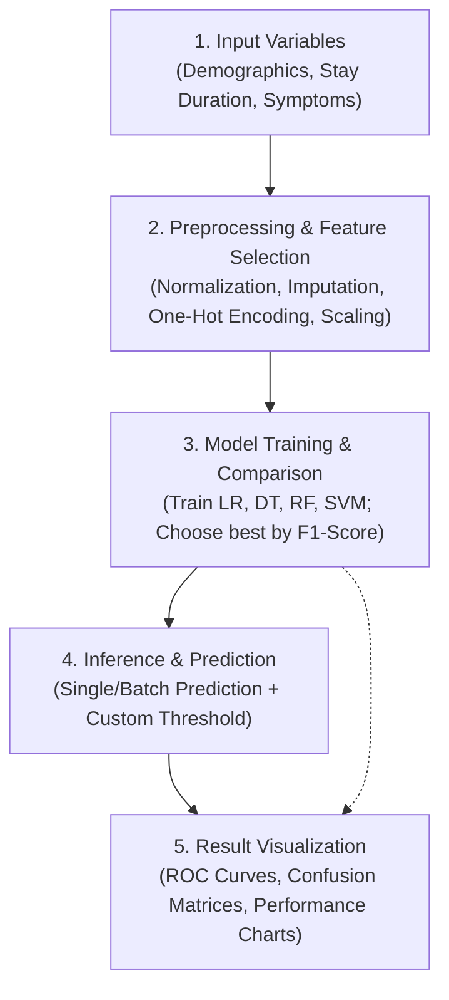
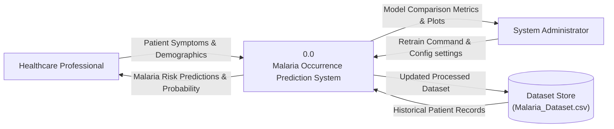
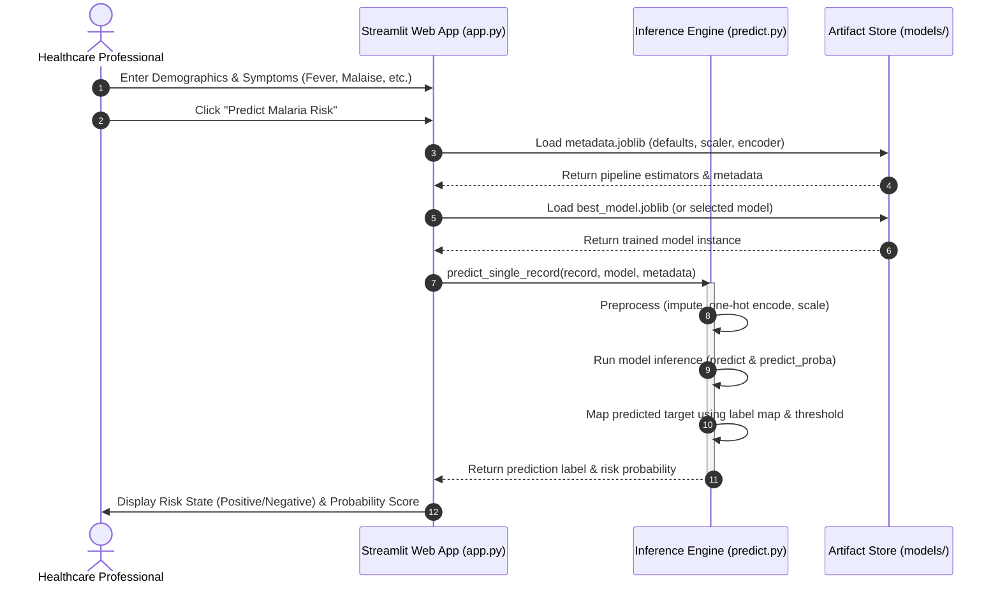
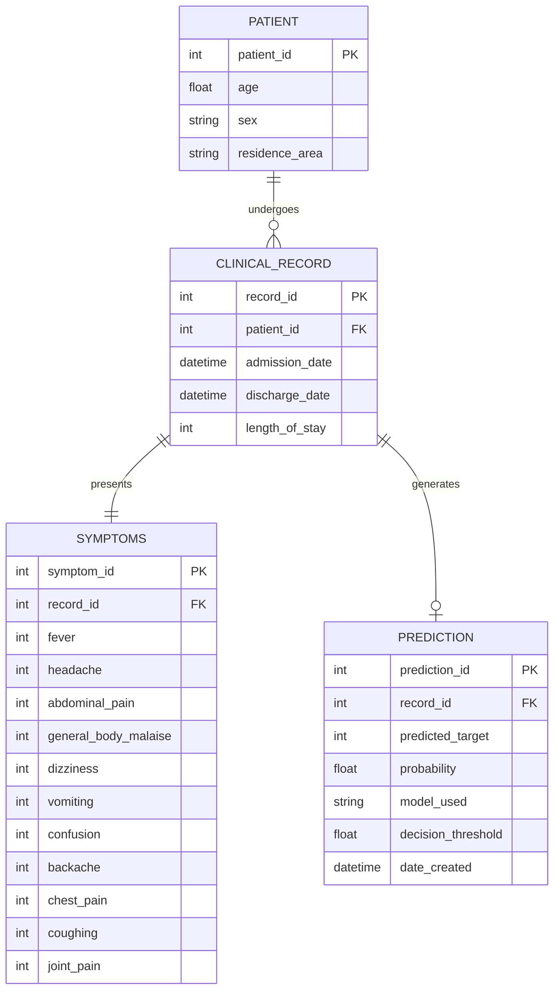
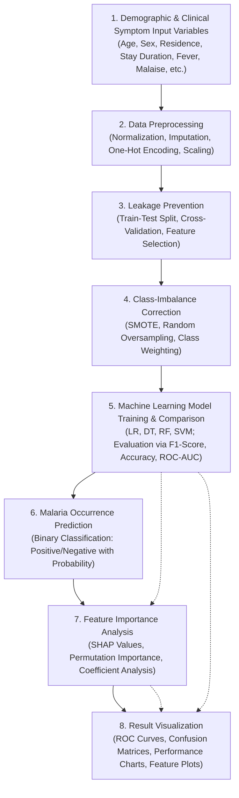

# Proposed System Architecture & Process Diagrams

This document contains Mermaid diagrams detailing the architecture, data flows, use cases, and logical entities of the Malaria Occurrence Prediction System.

---

## 1. System Pipeline Flowchart
This diagram outlines the progression from raw demographics and clinical symptoms inputs, through preprocessing and feature selection, model training and selection, up to inference and result visualization.



---

## 2. Use Case Diagram of the Proposed System
This diagram shows the actions that the Healthcare Professional and System Administrator can perform within the boundary of the prediction system.

```mermaid
flowchart LR
    Admin["System Administrator / Developer"]
    Clinician["Healthcare Professional<br>(Clinician / Nurse)"]

    subgraph System ["Malaria Occurrence Prediction System"]
        UC1(["Input Patient demographics & symptoms"])
        UC2(["Predict Malaria Occurrence & Risk"])
        UC3(["Adjust Classification Threshold"])
        UC4(["Retrain Predictive ML Models"])
        UC5(["View Comparative Model Performance"])
        UC6(["Preview Dataset & Statistics"])
    end

    Clinician --> UC1
    Clinician --> UC2
    Clinician --> UC3
    Clinician --> UC5
    Clinician --> UC6

    Admin --> UC4
    Admin --> UC5
    Admin --> UC6

    UC1 -.->|includes|-> UC2
```

---

## 3. Data Flow Diagram (Level 0) of the Proposed System
The Context Diagram (DFD Level 0) models the system as a single process, showing the interfaces between the prediction engine and external entities.



---

## 4. Sequence Diagram of the Prediction Process
This diagram illustrates the step-by-step messaging and invocation sequence when a healthcare professional requests a malaria risk prediction.



---

## 5. Entity Relationship Diagram of the Proposed System
This diagram shows the logical database schemas, types, and attributes modeling patients, clinical records, symptoms, and generated model predictions.



---

## 6. Conceptual Framework of the Study
This diagram depicts the progression from Demographic and Clinical Symptom Input Variables, through Data Preprocessing, Leakage Prevention, and Class-Imbalance Correction, to Machine Learning Model Training and Comparison, culminating in Malaria Occurrence Prediction, Feature Importance Analysis, and Result Visualization.


